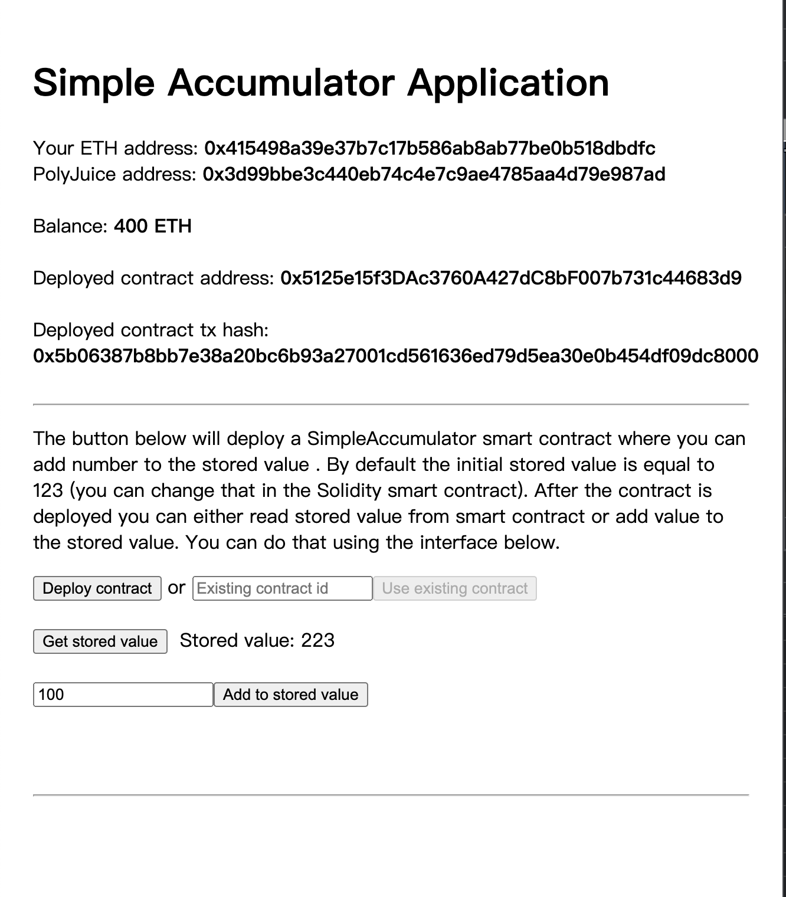

# Gitcoin: 7) Port An Existing Ethereum DApp To Polyjuice

## Screenshots or video of your application running on Godwoken.



## Link to the GitHub repository with your application which has been ported to Godwoken. This must be a different application than the one covered in this guide.

https://github.com/cryptoHong/Nervos-Hackathon/tree/main/task7/simple-accumulator

## If you deployed any smart contracts as part of this tutorial, please provide the transaction hash of the deployment transaction, the deployed contract address, and the ABI of the deployed smart contract. (Provide all in text format.)

contract address: 0x5125e15f3DAc3760A427dC8bF007b731c44683d9

deployed contract txhash: 0x5b06387b8bb7e38a20bc6b93a27001cd561636ed79d5ea30e0b454df09dc8000

```
[
    {
      "inputs": [],
      "stateMutability": "payable",
      "type": "constructor"
    },
    {
      "inputs": [
        {
          "internalType": "uint256",
          "name": "x",
          "type": "uint256"
        }
      ],
      "name": "add",
      "outputs": [],
      "stateMutability": "payable",
      "type": "function"
    },
    {
      "inputs": [],
      "name": "get",
      "outputs": [
        {
          "internalType": "uint256",
          "name": "",
          "type": "uint256"
        }
      ],
      "stateMutability": "view",
      "type": "function"
    }
  ]
  ```
