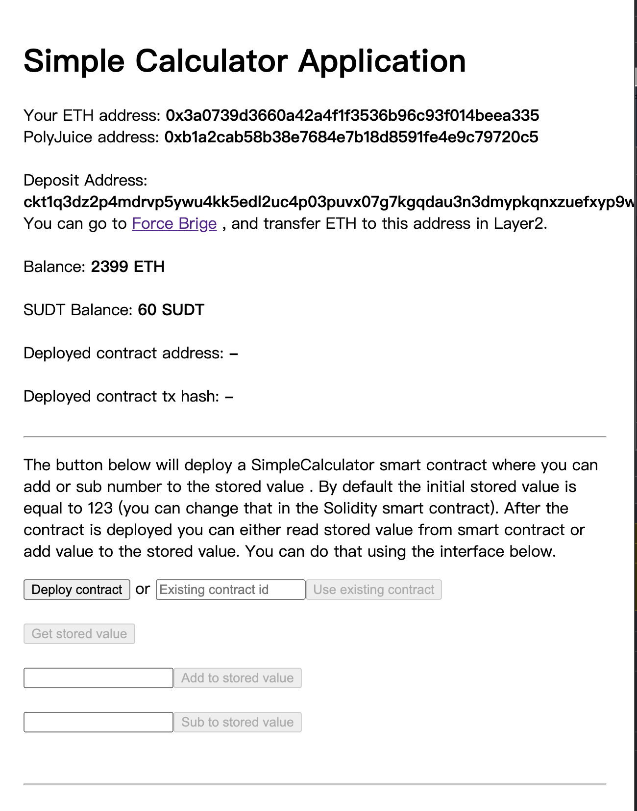

# Gitcoin: 8) Modify The Ported DApp So It Supports Ethereum Assets Via Force Bridge

## 1.A screenshot or video of your EVM application on Layer 2 with Force Bridge support.

## 2.The address of the SUDT-ERC20 Proxy Contract that you deployed (in text format).

0x98d8EcD3C6FA5a071E3059556F86A79659352BC1

## 3.A link to the GitHub repository with your EVM application that integrates Force Bridge support.

https://github.com/cryptoHong/Nervos-Hackathon/tree/main/task8/dapp-task8
